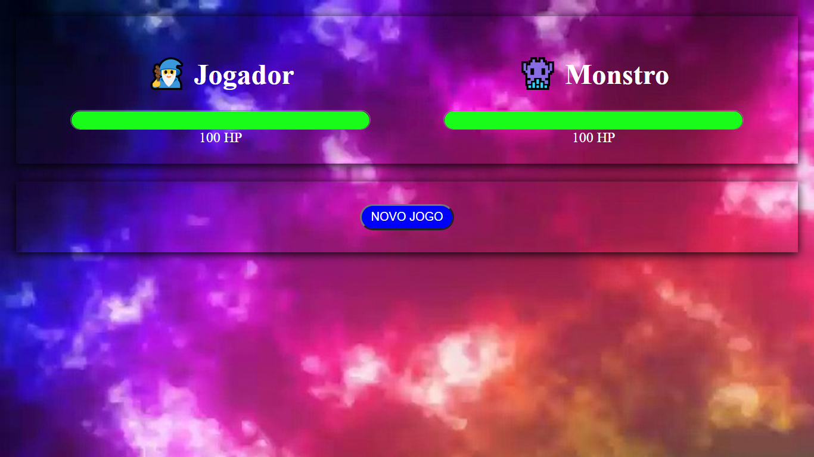
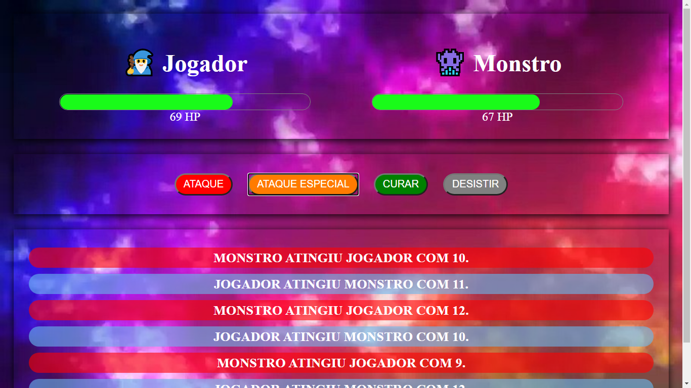

  

## 🖥 Preview

  

  

---

## 📖 Sobre

Jogo criado com o Vue.js, onde ao clicar nos botões o jogador duela contra um monstro. Criado a partir do básico do Vue.js..

---

## 🛠 Tecnologias Usadas

- CSS
- HTML
- Javascript
- Vue.js

---

## 🚀 Como executar o projeto

#### Clone o repositório

git clone https://github.com/vlarysc/MatadorDeMonstro-Game.git

#### Entre na Pasta

`cd matador-de-monstro`

#### Iniciando o Jogo

- click com o botão direito do mouse no arquivo `index.html` 
- click em `open with liveserver`

---

Desenvolvido com 💙 by Vlarysc
